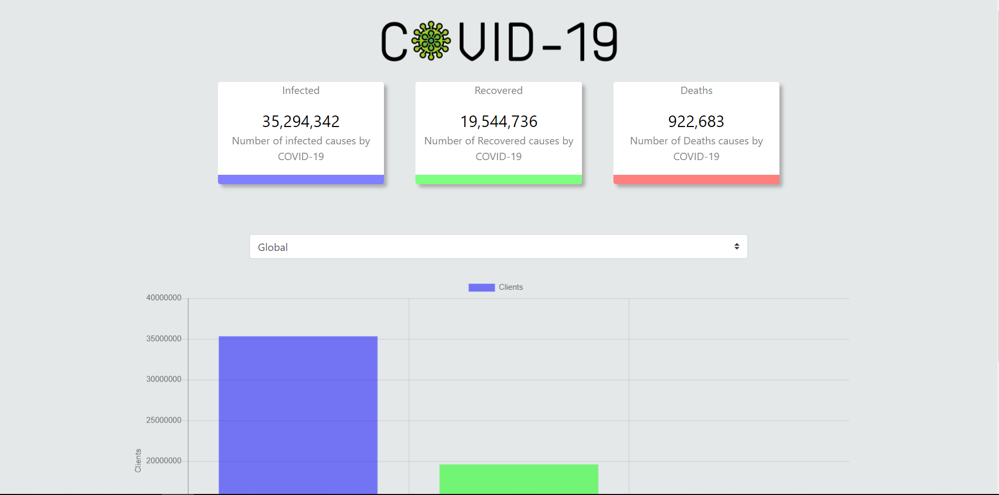
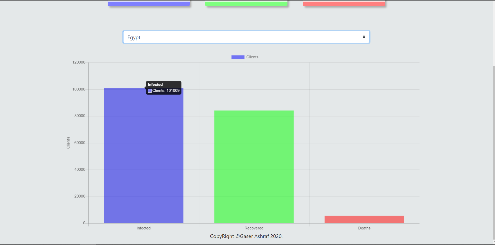

# Corona Tracker
Corona Tracker is a simple website track the infected,Recovered and Deaths causes using api
## ?? Build with
* vanilla javascript fetch api
* chart.js
* countUp.js
## ?? Screen Shots

